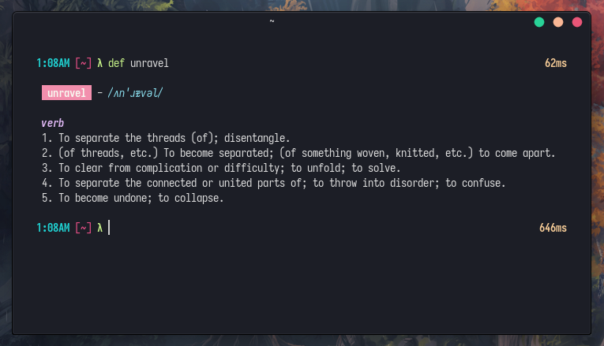

# def

> A comfy dictionary navigator for the command line. ☁️



<!-- [](https://github.com/x6r/def/releases)
[](https://github.com/x6r/def/actions)
[](https://goreportcard.com/report/github.com/x6r/def) -->

## Installation

### Binaries

Download a binary from the [releases](https://github.com/x6r/def/releases)
page.

### Build from source

Go 1.16 or higher required. ([install instructions](https://golang.org/doc/install.html))

    go install github.com/x6r/def@latest

## Usage

```sh
$ def <word>
```

`def -h` for more information.

### Flags

- `-r`, `--related`: displays synonyms and antonyms if found
- `-e`, `--examples`: displays examples if found
- `-f`, `--full`: displays synonyms, antonyms and examples if found

## License

[ISC](LICENSE)
